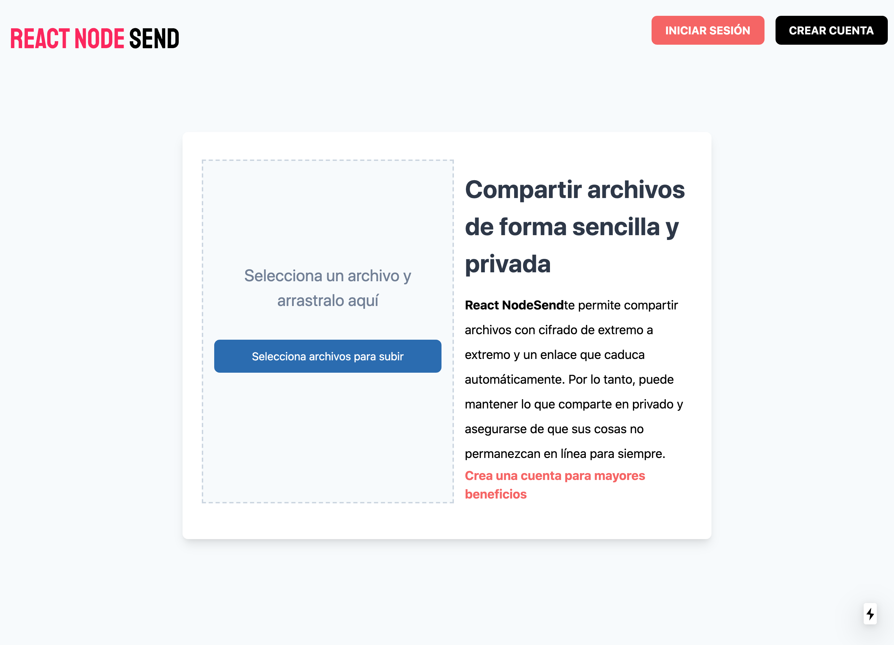

# App de clon of firefox send

Esta es una aplicacion creada con el framework nextJs para 
poder subir tus archivos y compartir el enlace de descarga.

# Technologies

Next
Context API
JWT
Mongo Atlas
Express
Node
Dropzone library
Tail
Tailwind css

## Cómo funciona?

Requiere nodeJs

- `npm install` para instalar las dependencias.
- `npm run dev` para el entorno de desarrollo backend.
- `npm run dev` para el entorno de desarrollo frontend.

## Licencia

MIT
